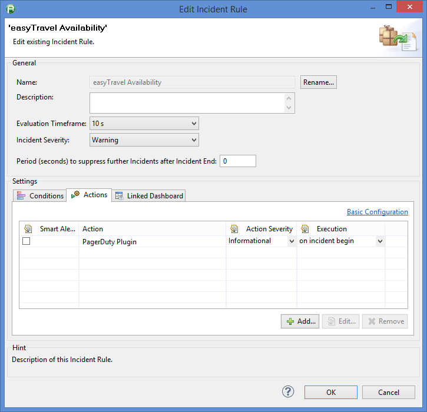
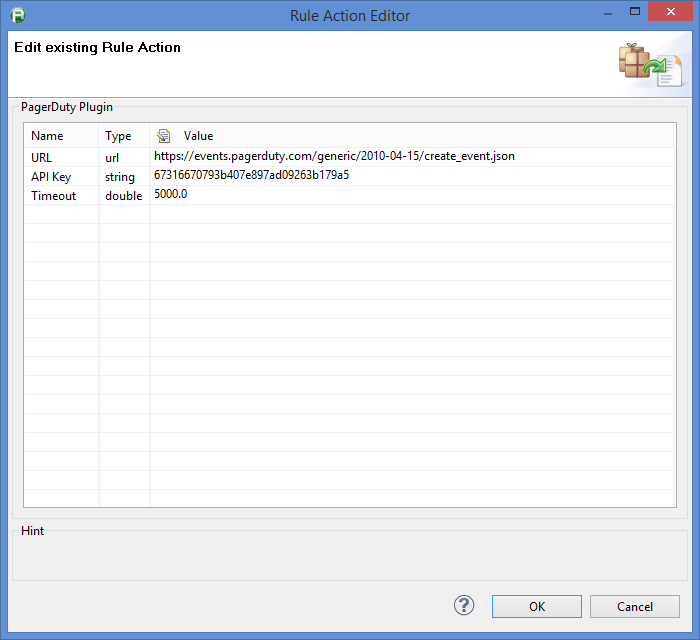
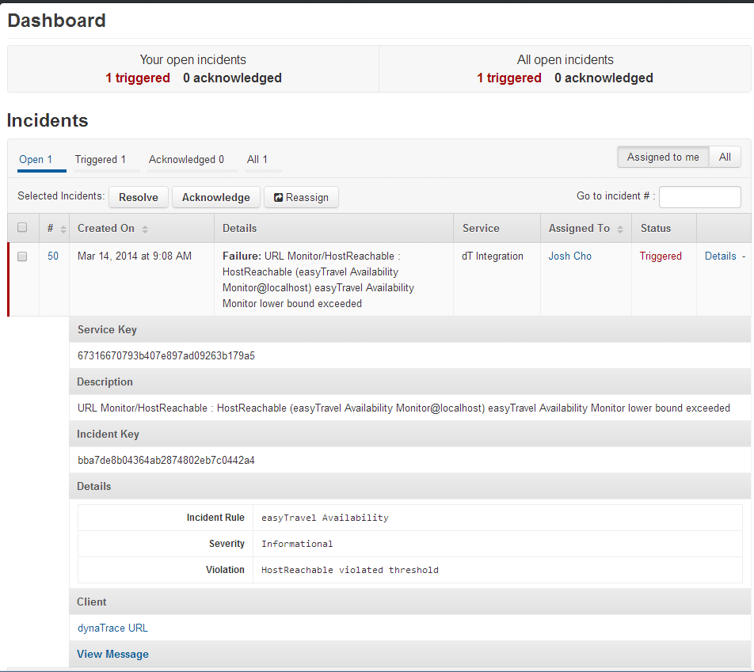

<html xmlns="http://www.w3.org/1999/xhtml">
<head>
    <title>PagerDuty Action Plugin</title>
    <meta http-equiv="Content-Type" content="text/html; charset=UTF-8"/>
    <meta http-equiv="X-UA-Compatible" content="IE=EmulateIE8" />
    <meta content="Scroll Wiki Publisher" name="generator"/>
    <link type="text/css" rel="stylesheet" href="css/blueprint/liquid.css" media="screen, projection"/>
    <link type="text/css" rel="stylesheet" href="css/blueprint/print.css" media="print"/>
    <link type="text/css" rel="stylesheet" href="css/content-style.css" media="screen, projection, print"/>
    <link type="text/css" rel="stylesheet" href="css/screen.css" media="screen, projection"/>
    <link type="text/css" rel="stylesheet" href="css/print.css" media="print"/>
</head>
<body>
                <h1>PagerDuty Action Plugin</h1>
    

        <h2>Overview</h2>
    

            
            

    

Allows dynaTrace incidents to be forwarded to PagerDuty via PagerDuty API.    

    

Checks the API URL first using a GET request then processes the incident using POST.    

    

    

        <h2>Plugin Details</h2>
    

        <table>
<thead class=" "></thead><tfoot class=" "></tfoot><tbody class=" ">    <tr>
            <td rowspan="1" colspan="1">
        

Author    

            </td>
                <td rowspan="1" colspan="1">
        

Josh Cho (<a href="mailto:josh.cho@compuware.com">josh.cho@compuware.com</a>)    

            </td>
        </tr>
    <tr>
            <td rowspan="1" colspan="1">
        

dynaTrace Versions    

            </td>
                <td rowspan="1" colspan="1">
        

5.5, 5.6    

            </td>
        </tr>
    <tr>
            <td rowspan="1" colspan="1">
        

License    

            </td>
                <td rowspan="1" colspan="1">
        

<a href="attachments_5275722_2_dynaTraceBSD.txt">dynaTrace BSD</a>    

            </td>
        </tr>
    <tr>
            <td rowspan="1" colspan="1">
        

Support    

            </td>
                <td rowspan="1" colspan="1">
        

Community Supported    

            </td>
        </tr>
    <tr>
            <td rowspan="1" colspan="1">
        

Known Problems    

            </td>
                <td rowspan="1" colspan="1">
        

None (Yet...)    

            </td>
        </tr>
    <tr>
            <td rowspan="1" colspan="1">
        

Release History    

            </td>
                <td rowspan="1" colspan="1">
        

2014-03-14 Initial Release    

            </td>
        </tr>
    <tr>
            <td rowspan="1" colspan="1">
        

Download    

            </td>
                <td rowspan="1" colspan="1">
        

<a href="attachments_160761820_1_com.dynatrace.pagerduty_1.0.0.jar.zip">com.dynatrace.pagerduty_1.0.0.jar.zip</a>    

            </td>
        </tr>
</tbody>        </table>
            

    

    

        <h2>Installation</h2>
    

Import the Plugin into the dynaTrace Server. For details how to do this please refer to the <a href="https://community/display/DOCDT56/Plugin+Management">Online Documentation on Plugin Management</a>.    

    

    

        <h2>Configuration</h2>
<ol class=" "><li class=" ">    

Select the incident you want to set up PagerDuty alerting against and open the edit dialog.    

</li><li class=" ">    

In the 'Actions' tab, ensure the PagerDuty Plugin is added and set to fire 'on incident begin'.    

</li><li class=" ">    

Ensure correct API key is added from your PagerDuty services. Optionally set URL and/or TCP timeout.    

</li></ol>    

The following screenshot shows an example configuration:    

    

            
            

    

            
            

    

            
            

    

Logs should indicate each incident that is forwarded:    

    

2014-03-14 09:07:51 INFO [<a href="mailto:PagerDutyActionPlugin@com.dynatrace.pagerduty.action">PagerDutyActionPlugin@com.dynatrace.pagerduty.action</a>] Successfully forwarded incident to PagerDuty for incident: URL Monitor/HostReachable : HostReachable (easyTravel Availability Monitor@localhost) easyTravel Availability Monitor lower bound exceeded. The incident key is: bba7de8b04364ab2874802eb7c0442a4    

    

    

    

Set logs to FINE if more detail is required:    

    

2014-03-14 09:07:50 FINE [<a href="mailto:PagerDutyActionPlugin@com.dynatrace.pagerduty.action">PagerDutyActionPlugin@com.dynatrace.pagerduty.action</a>] Checking connectivity... 2014-03-14 09:07:50 FINE [<a href="mailto:PagerDutyActionPlugin@com.dynatrace.pagerduty.action">PagerDutyActionPlugin@com.dynatrace.pagerduty.action</a>] Sending 'GET' request to URL : <a href="https://events.pagerduty.com/generic/2010-04-15/create_event.json">https://events.pagerduty.com/generic/2010-04-15/create_event.json</a> 2014-03-14 09:07:51 FINE [<a href="mailto:PagerDutyActionPlugin@com.dynatrace.pagerduty.action">PagerDutyActionPlugin@com.dynatrace.pagerduty.action</a>] Response Code : 400 2014-03-14 09:07:51 FINE [<a href="mailto:PagerDutyActionPlugin@com.dynatrace.pagerduty.action">PagerDutyActionPlugin@com.dynatrace.pagerduty.action</a>] Incident URL Monitor/HostReachable : HostReachable (easyTravel Availability Monitor@localhost) easyTravel Availability Monitor lower bound exceeded triggered. 2014-03-14 09:07:51 FINE [<a href="mailto:PagerDutyActionPlugin@com.dynatrace.pagerduty.action">PagerDutyActionPlugin@com.dynatrace.pagerduty.action</a>] Using API KEY - 67316670793b407e897ad09263b179a5 2014-03-14 09:07:51 FINE [<a href="mailto:PagerDutyActionPlugin@com.dynatrace.pagerduty.action">PagerDutyActionPlugin@com.dynatrace.pagerduty.action</a>] Measure HostReachable (easyTravel Availability Monitor@localhost) violoated threshold. 2014-03-14 09:07:51 FINE [<a href="mailto:PagerDutyActionPlugin@com.dynatrace.pagerduty.action">PagerDutyActionPlugin@com.dynatrace.pagerduty.action</a>] Measure HostReachable violoated threshold. 2014-03-14 09:07:51 FINE [<a href="mailto:PagerDutyActionPlugin@com.dynatrace.pagerduty.action">PagerDutyActionPlugin@com.dynatrace.pagerduty.action</a>] JSON String is: {&quot;service_key&quot;:&quot;67316670793b407e897ad09263b179a5&quot;,&quot;details&quot;:{&quot;Severity&quot;:&quot;Informational&quot;,&quot;Incident Rule&quot;:&quot;easyTravel Availability&quot;,&quot;Violation&quot;:&quot;HostReachable violated threshold&quot;},&quot;client&quot;:&quot;dynaTrace&quot;,&quot;description&quot;:&quot;URL Monitor\/HostReachable : HostReachable (easyTravel Availability Monitor@localhost) easyTravel Availability Monitor lower bound exceeded&quot;,&quot;event_type&quot;:&quot;trigger&quot;,&quot;client_url&quot;:&quot;slo124829n01&quot;} 2014-03-14 09:07:51 FINE [<a href="mailto:PagerDutyActionPlugin@com.dynatrace.pagerduty.action">PagerDutyActionPlugin@com.dynatrace.pagerduty.action</a>] Trying to get output stream... 2014-03-14 09:07:51 FINE [<a href="mailto:PagerDutyActionPlugin@com.dynatrace.pagerduty.action">PagerDutyActionPlugin@com.dynatrace.pagerduty.action</a>] Trying to write to output stream 2014-03-14 09:07:51 FINE [<a href="mailto:PagerDutyActionPlugin@com.dynatrace.pagerduty.action">PagerDutyActionPlugin@com.dynatrace.pagerduty.action</a>] Trying to connect... 2014-03-14 09:07:51 FINE [<a href="mailto:PagerDutyActionPlugin@com.dynatrace.pagerduty.action">PagerDutyActionPlugin@com.dynatrace.pagerduty.action</a>] Response Code : 200 2014-03-14 09:07:51 FINE [<a href="mailto:PagerDutyActionPlugin@com.dynatrace.pagerduty.action">PagerDutyActionPlugin@com.dynatrace.pagerduty.action</a>] Status: success 2014-03-14 09:07:51 FINE [<a href="mailto:PagerDutyActionPlugin@com.dynatrace.pagerduty.action">PagerDutyActionPlugin@com.dynatrace.pagerduty.action</a>] Message: Event processed 2014-03-14 09:07:51 FINE [<a href="mailto:PagerDutyActionPlugin@com.dynatrace.pagerduty.action">PagerDutyActionPlugin@com.dynatrace.pagerduty.action</a>] Incident Key: bba7de8b04364ab2874802eb7c0442a4    

    

    
Feedback    
    

    

Please provide feedback on this plugin either by commenting on this page or by comments on the <a href="https://community/display/DTFORUM/Community+Plugins+and+Extensions">Community Plugins and Extensions</a>    

    

            

        

        

        

    

</body>
</html>
